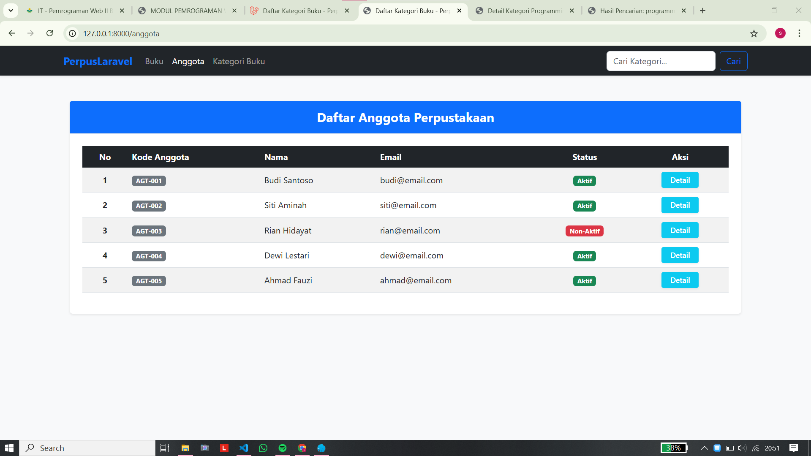
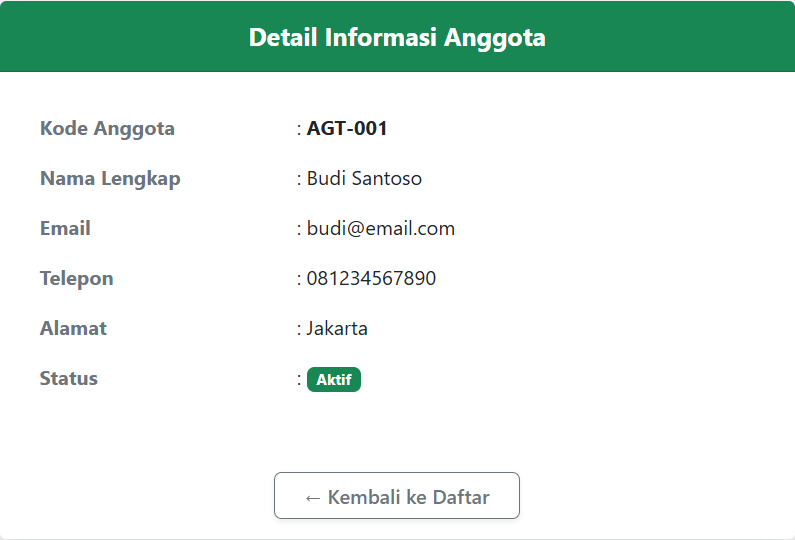
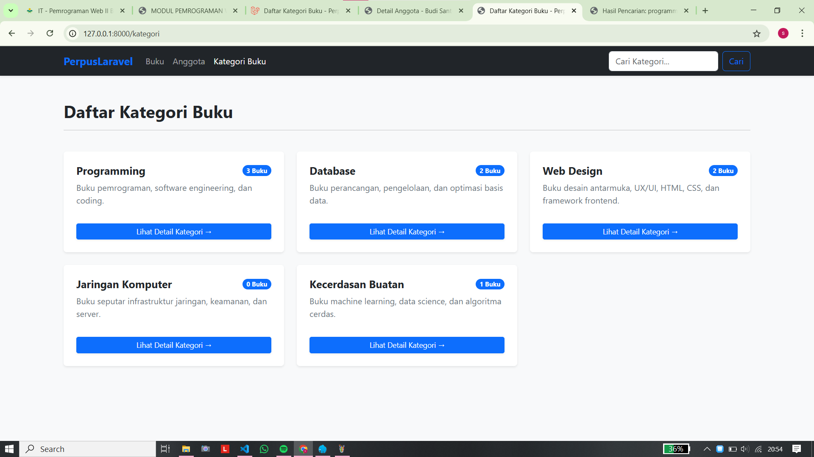
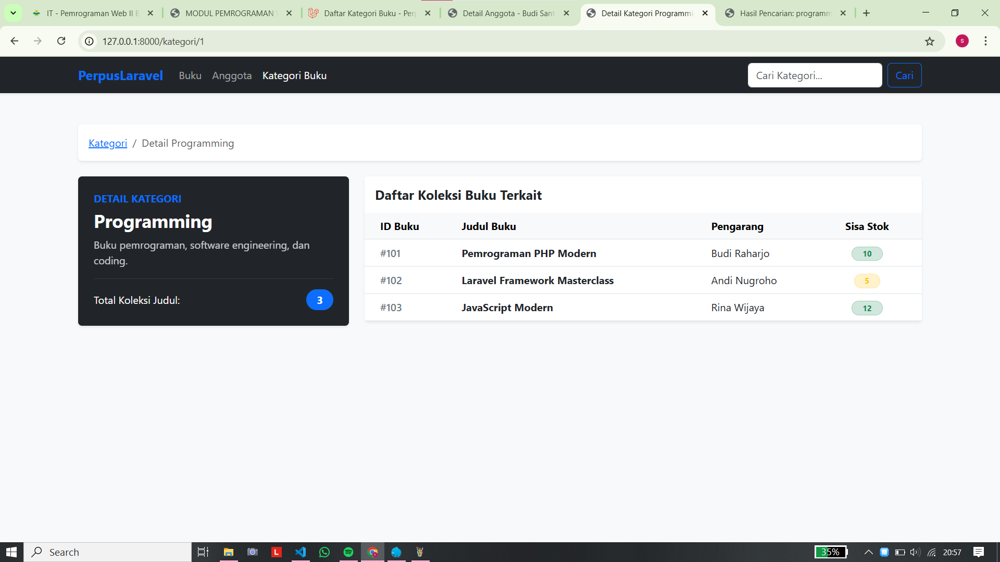
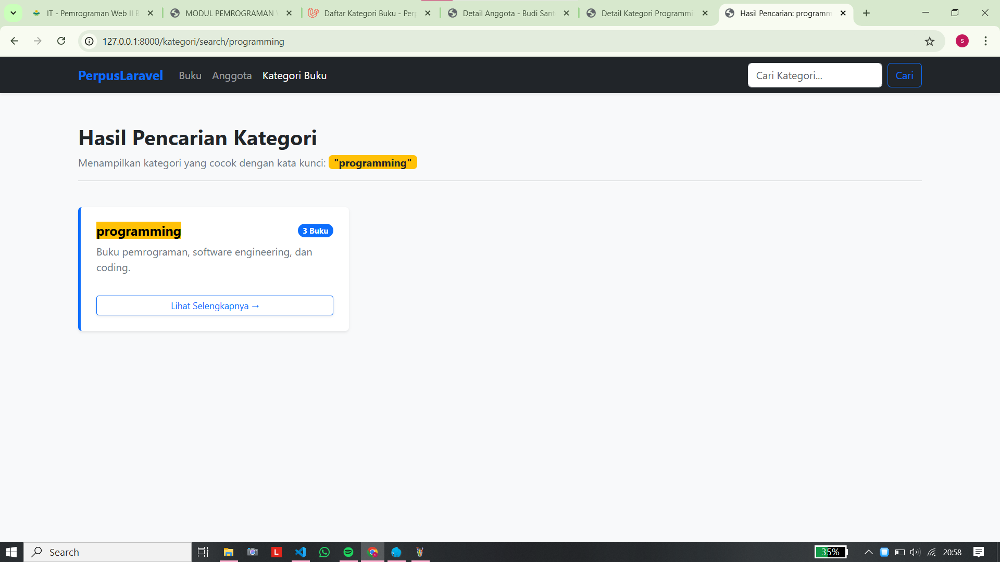

# TUGAS PEMROGRAMAN WEB 2 - PERTEMUAN 9

## Screenshot Hasil

### 1. Daftar Anggota
> Source: [`resources/views/anggota/index.blade.php`](resources/views/anggota/index.blade.php)  

### 2. Detail Anggota
> Source: [`resources/views/anggota/show.blade.php`](resources/views/anggota/show.blade.php)  

### 3. Daftar Kategori
> Source: [`resources/views/kategori/index.blade.php`](resources/views/kategori/index.blade.php) 

### 4. Detail Kategori
> Source: [`resources/views/kategori/show.blade.php`](resources/views/kategori/show.blade.phpou)  

### 5. Pencarian Kategori
> Source: [`resources/views/kategori/search.blade.php`](resources/views/kategori/search.blade.php)  
